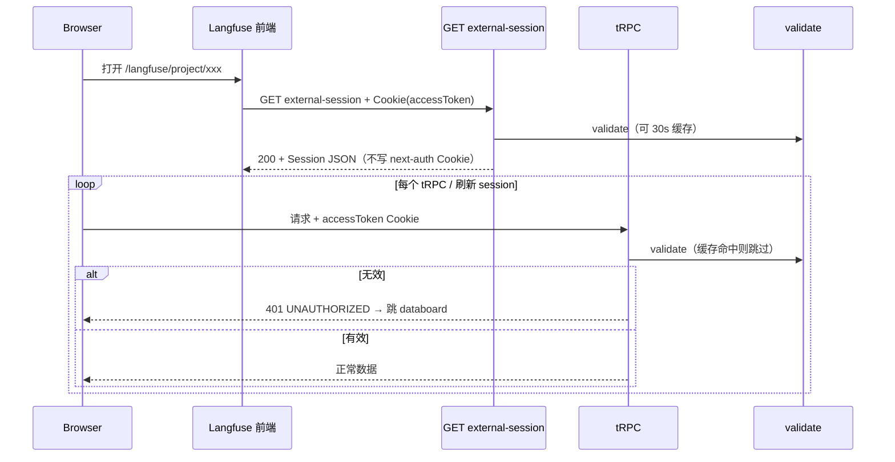

告诉我你现在实现的流程和之前的有什么区别

validate 有 30s 内存缓存，不是每个请求都打穿 aiops 为什么只有30s 不应该校验失败再清空吗 每个请求之前都会校验。

  if (!validation.ok) {

​    invalidateCachedSession(accessToken);

​    return null;

你的理解是对的：若要求「每个请求都向 aiops 校验」，就不该用固定 30s 挡掉 validate。下面说明原因，以及我刚按你的思路改的配置。

## 为什么当初有 30s 缓存

不是为了「少做鉴权」，而是 性能折中：

- 打开一个 Langfuse 页面，浏览器往往会发 很多个 tRPC 请求（列表、图表、权限等）
- 若每个 tRPC 都打一次 `GET validate?accessToken=`，aiops 压力会成倍增加，页面也会变慢
- 所以用 「同一 accessToken + 30s 内复用上次 validate 结果」 减少重复调用

副作用你也说中了：

- 主应用已登出 / token 失效，Langfuse 在 30s 内仍可能用旧缓存 当已登录
- 这和「主应用状态一变，Langfuse 立刻失效」不一致

## 「校验失败再清空」 vs 「30s 过期」

| 策略                          | 行为                                                |
| :---------------------------- | :-------------------------------------------------- |
| 30s TTL（旧默认）             | 30s 内可能不调 validate，即使用户已登出             |
| 失败即清缓存（更合理）        | 一旦 validate 返回 401，立刻删掉该 token 的缓存     |
| TTL=0（你要的「每请求校验」） | 每次 `getServerAuthSession` 都调 validate，不用缓存 |

理想组合是：失败即清缓存 + TTL=0（默认每请求 validate）；若以后压力大，再把 TTL 设为 5～10s 作性能开关。

## 已按你的思路改的行为

1. 默认 `EXTERNAL_AUTH_VALIDATE_CACHE_TTL_SECONDS=0`
   - `0` = 不缓存，每个请求都会调 validate（和「per_request」语义一致）
2. validate 失败时立即 `invalidateCachedSession(accessToken)`
   - 若你后来把 TTL 设为 >0，401 也会马上清缓存，不会继续用旧 session
3. 仅当 TTL > 0 时才走缓存
   - 需要减压时可设 `EXTERNAL_AUTH_VALIDATE_CACHE_TTL_SECONDS=30`，并保留失败清缓存

## 当前实际流程（默认 TTL=0）

每个 tRPC / external-session

  → 读 Cookie accessToken

  → GET validate?accessToken=   （每次都打）

  → 成功：拼 Session

  → 失败：清缓存 + session=null → 401 → 前端跳 databoard

## 配置说明

*# 默认：每个请求都 validate（推荐给你现在的需求）*

EXTERNAL_AUTH_VALIDATE_CACHE_TTL_SECONDS=0

*# 仅在高并发、想减轻 aiops 压力时再用（失败仍会清缓存）*

*# EXTERNAL_AUTH_VALIDATE_CACHE_TTL_SECONDS=30*

------

总结：30s 是当初为了 少打 validate，不是业务上「30s 内不用校验」；你要的是 每请求校验 + 失败立刻作废，默认已改为 TTL=0（每请求打穿）+ 401 时清缓存。若 `.env` 里还写着 `30`，改成 `0` 或删掉该行即可。

 TTL 设为 10s

​      .optional()

​      .default(0),

​      .default(10),

​    *// EMAIL*

​      EXTERNAL_AUTH_VALIDATION_MODE: ${EXTERNAL_AUTH_VALIDATION_MODE:-per_request}

​      EXTERNAL_AUTH_VALIDATE_CACHE_TTL_SECONDS: ${EXTERNAL_AUTH_VALIDATE_CACHE_TTL_SECONDS:-0}

​      EXTERNAL_AUTH_VALIDATE_CACHE_TTL_SECONDS: ${EXTERNAL_AUTH_VALIDATE_CACHE_TTL_SECONDS:-10}

​      NEXT_PUBLIC_EXTERNAL_AUTH_VALIDATION_MODE: ${NEXT_PUBLIC_EXTERNAL_AUTH_VALIDATION_MODE:-per_request}

已将 validate 缓存 TTL 默认改为 10 秒。

| 文件                                  | 变更                                                 |
| :------------------------------------ | :--------------------------------------------------- |
| `web/src/env.mjs`                     | `EXTERNAL_AUTH_VALIDATE_CACHE_TTL_SECONDS` 默认 `10` |
| `docker-compose.langfuse-subpath.yml` | compose 默认 `:-10`                                  |

行为说明：

- 同一 `accessToken` 在 10s 内复用上次 validate 成功的 Session，减少对 aiops 的调用
- validate 返回 401 时仍会 立即清缓存，不会继续用旧会话
- 设为 `0` 则每个请求都打 validate；在 `.env` 里写 `EXTERNAL_AUTH_VALIDATE_CACHE_TTL_SECONDS=0` 即可

修改后需 重启 `dev:web` 或重建容器后生效。

帮我再生成一下使用前端cookie only 携带的cookies和去调用validate 校验的整个架构图

## 整体部署架构（同域 + Cookie only）

浏览器 https://10.151.18.110:31987Nginx 反向代理（同域）微前端 / aiops 登录Langfuse Web（Next.js）前端（浏览器）后端（Node）aiops 后端（集群内网）credentials: includecredentials: include微前端 /databoard登录后写入 httpOnly CookieLangfuse /langfuse/project/...Cookie: accessToken=xxxPath=/ HttpOnly（JS 读不到）/ → 微前端/langfuse/ → Langfuse Web主应用 API 登录useAuthGuarduseAuthSessiontRPC 客户端GET /api/auth/external-sessioncreateTRPCContextgetServerAuthSessionresolveSessionFromExternalAuthvalidateExternalAuthGET /internal/auth/validate?accessToken=

要点：

- 只有浏览器自动带 Cookie；前端 不传 `accessToken` 参数。
- Langfuse 后端从 `req.headers.cookie` 解析 token，再调 validate。
- aiops 地址 不暴露给浏览器。

------

## 核心鉴权流程（`per_request` + 10s 缓存）

alt [200][401]alt [10s 内同 token 且缓存有效][未命中或已过期]alt [session 有效][无效]loop [每个 tRPC 业务请求]登录成功Set-Cookie accessTokenHttpOnly Path=/打开 /langfuse/project/xxx页面加载（自动带 Cookie）GET /langfuse/api/auth/external-sessioncredentials: includeresolveSessionFromExternalAuth(cookie)命中Session从 Cookie 解析 accessTokenGET validate?accessToken=xxxuserId, userName查/建用户 + 项目权限写入缓存 TTL=10s401立即清缓存session = null200 Session 或 401POST /api/trpc/...credentials: includegetServerAuthSession → 同上业务数据UNAUTHORIZED 401跳转 databoard请求头 Cookie: accessToken=xxx前端 JS 不读取 token用户微前端 databoard浏览器Langfuse 前端Langfuse APIexternal-session / tRPCresolveSessionFromExternalAuth内存缓存 10saiops validateLangfuse DB

------

## Cookie only：谁拿、谁用

浏览器（前端 JS）Langfuse 服务端httpOnly CookieaccessTokenfetch(..., credentials: 'include')❌ 不读 document.cookie 里的 accessToken❌ 不调用内网 validate URLreq.headers.cookieextractAccessTokenFromCookie()GET validate?accessToken=buildAppSessionForEmail()

| 步骤 | 位置            | 做什么                                                  |
| :--- | :-------------- | :------------------------------------------------------ |
| 1    | 微前端登录      | 写 `accessToken` Cookie（`HttpOnly`, `Path=/`）         |
| 2    | 浏览器          | 访问 `/langfuse/*` 时 自动附带 Cookie                   |
| 3    | Langfuse 前端   | 只发 `credentials: 'include'`，不带 token 参数          |
| 4    | Langfuse 后端   | 解析 Cookie → validate → 拼 Session                     |
| 5    | tRPC middleware | `session` 为空 → 401                                    |
| 6    | 前端            | 401 → 跳 `NEXT_PUBLIC_EXTERNAL_AUTH_LOGIN_REDIRECT_URL` |

------

## 与 `next-auth.session-token` 的关系（当前默认）

当前 per_request（默认）旧 bridge 模式（可选）主应用 accessToken Cookievalidate内存 Session 结构（给 tRPC / UI 用）❌ 不依赖 next-auth.session-tokenaccessToken Cookievalidate 一次Set-Cookienext-auth.session-token后续只验 JWT

------

## 配置摘要（与你环境一致）

EXTERNAL_AUTH_ENABLED=true

EXTERNAL_AUTH_VALIDATION_MODE=per_request

EXTERNAL_AUTH_ACCESS_TOKEN_COOKIE=accessToken

EXTERNAL_AUTH_VALIDATE_URL=http://aiops-ai-backend-service-svc.infra.svc.cluster.local:80/internal/auth/validate

EXTERNAL_AUTH_VALIDATE_CACHE_TTL_SECONDS=10   *# 10s 内复用；401 立即清缓存*

NEXT_PUBLIC_EXTERNAL_AUTH_ENABLED=true

NEXT_PUBLIC_EXTERNAL_AUTH_VALIDATION_MODE=per_request

NEXT_PUBLIC_EXTERNAL_AUTH_LOGIN_REDIRECT_URL=https://10.151.18.110:31987/databoard

NEXT_PUBLIC_BASE_PATH=/langfuse

------

## 关键 API 一览

| 调用方           | 方法 | 路径                                  | Cookie     | 作用                          |
| :--------------- | :--- | :------------------------------------ | :--------- | :---------------------------- |
| Langfuse 前端    | GET  | `/langfuse/api/auth/external-session` | ✅ include  | 页面登录态 / `useAuthSession` |
| Langfuse 前端    | POST | `/langfuse/api/trpc/*`                | ✅ include  | 业务数据；context 内 validate |
| 仅 Langfuse 后端 | GET  | aiops `.../validate?accessToken=`     | 服务端发起 | 浏览器不访问                  |

如果你需要把这张图放进 `LANGFUSE_SUBPATH_DEPLOYMENT.md` 或单独 markdown 文件，可以说一下我帮你写入仓库。

externalAuth.ts (299-310) 没有user.email不能实现吗上面的

说明：`validate` 不返回 email；我们已用 `userId` 合成邮箱。`if (!user.email)` 仅为防御性检查。正在改为在缺少 email 时用合成邮箱回退，避免因 DB 中 email 为空而失败。

  if (!user.email) {

​    return null;

  }

  if (!user.email) {

​    return { ok: false, status: 500, error: "error" };

  }

可以实现，而且本来就不是靠 validate 返回 `email`。 上面的 Cookie + validate 流程不依赖主应用给用户一个真实邮箱。

## validate 实际返回什么

{ "userId": "string", "userName": "string" }

没有 `email`。鉴权只靠 `accessToken` + userId。

## Langfuse 里 email 是干什么的

Langfuse 的 `User` 表和 NextAuth 会话习惯用 `email` 当唯一键（`session` callback、`buildAppSessionForEmail` 都是按 email 查库）。

所以代码里用 `userId` 合成一个内部邮箱，并不是要求主应用提供邮箱：

externalAuth.tsLines 140-145

function buildExternalUserEmail(externalUserId: string): string {

  const normalizedId = externalUserId

​    .toLowerCase()

​    .replace(/[^a-z0-9._-]/g, "_");

  return `${normalizedId}@external.local`;

}

创建用户时一定会写入这个 email：

externalAuth.tsLines 196-208

  const email = buildExternalUserEmail(externalUserId);

  *// ...*

  user = await prisma.user.create({

​    data: {

​      email,

​      name: userName,

​      emailVerified: new Date(),

​    },

  });

因此：validate 没有 email 也能跑通；`userId` → 合成 email → 查/建 Langfuse 用户 → 拼 Session。

## 你标的那段 `if (!user.email)` 在干什么

那是 防御性判断：Prisma 里 `User.email` 类型是 `String?`（可为 null），理论上存在「库里用户没有 email」的边角情况。

正常走 `findOrCreateExternalUser` 时 几乎总会有 email；失败 500 多半不应该是「validate 没给 email」。

已改成 回退到合成 email，不再因 `user.email` 为空直接失败：

const sessionEmail = user.email ?? buildExternalUserEmail(validation.userId);

`per_request` 和 `bridge` 两处都已统一。

## 和架构图的关系

| 步骤              | 是否需要真实 email                    |
| :---------------- | :------------------------------------ |
| 浏览器带 Cookie   | ❌ 只要 `accessToken`                  |
| validate          | ❌ 只要 `userId` / `userName`          |
| Langfuse 建用户   | ✅ 用 合成的 `{userId}@external.local` |
| tRPC / UI Session | ✅ 用合成 email 查 DB，不是主应用邮箱  |

## 什么时候会真需要 email

只有当你希望 Langfuse 用户和主应用用同一个真实邮箱（例如 `userName` 本身就是邮箱）时，才要改映射策略，例如：

*// 可选策略：userName 像邮箱就用它，否则合成*

const email = userName.includes("@") ? userName : buildExternalUserEmail(userId);

当前默认 不需要 主应用 email，`userId` 就够。

------

结论：上面的 Cookie-only + validate 架构 不依赖 validate 返回 email；`user.email` 只是 Langfuse 内部账号键，由 `userId` 自动生成。原先 `!user.email` 只是兜底，现已改为合成 email 回退。

loop 每个 tRPC 业务请求

​        Browser->>LF_API: POST /api/trpc/... credentials: include

​        LF_API->>Resolve: getServerAuthSession → 同上

​        alt session 有效

​            LF_API-->>Browser: 业务数据

​        else 无效

​            LF_API-->>Browser: UNAUTHORIZED 401

​            LF_FE->>Browser: 跳转 databoard

​        end

​    end 和一段在哪实现的

你图里那段 「loop 每个 tRPC 业务请求」 不是某一处 `for` 循环，而是：浏览器每发一次 tRPC，Next.js 就再走一遍同一套 context → 鉴权链。对应代码如下。

## 总览：一次 tRPC 请求的链路

是否web/src/utils/api.tshttpLink → POST /api/trpc"web/src/pages/api/trpc/[trpcweb/src/server/api/trpc.tscreateTRPCContextweb/src/server/auth.tsgetServerAuthSessionweb/src/server/externalAuth.tsresolveSessionFromExternalAuthsession.user 存在?具体 router 业务逻辑enforceUserIsAuthedUNAUTHORIZEDweb/src/utils/api.tsredirectOnExternalAuthUnauthorized

------

## ① 浏览器 POST `/api/trpc/...`（带 Cookie）

文件：`web/src/utils/api.ts`

tRPC 客户端用 `httpLink` 打到 `/api/trpc`。同域请求浏览器会自动带上 Cookie（不必写 `credentials: include`，和 `external-session` 的显式 include 效果一样）。

api.tsLines 224-227

​          true: httpLink({

​            url: `${getBaseUrl()}/api/trpc`,

​            transformer: superjson,

​          }),

入口：`web/src/pages/api/trpc/[trpc].ts` — 每个 tRPC 请求都会进这里：

[trpc].tsLines 17-19

export default createNextApiHandler({

  router: appRouter,

  createContext: createTRPCContext,

------

## ② `getServerAuthSession` → `resolveSessionFromExternalAuth`（每次请求）

文件：`web/src/server/api/trpc.ts`

每个 tRPC 请求先建 context，里面一定会调 `getServerAuthSession`：

trpc.tsLines 57-71

export const createTRPCContext = async (opts: CreateNextContextOptions) => {

  const { req, res } = opts;

  *// Get the session from the server using the getServerSession wrapper function*

  const session = await getServerAuthSession({ req, res });

  *// Get the headers from the request*

  const headers = req.headers;

  addUserToSpan({

​    userId: session?.user?.id,

​    email: session?.user?.email ?? undefined,

  });

  return createInnerTRPCContext({ session, headers });

};

文件：`web/src/server/auth.ts` — `per_request` 时走 validate，不再读 NextAuth JWT：

auth.tsLines 904-908

  if (isExternalAuthPerRequest()) {

​    return resolveSessionFromExternalAuth(ctx.req.headers.cookie);

  }

文件：`web/src/server/externalAuth.ts` — 从 Cookie 取 token → validate → 拼 Session（10s 缓存 / 401 清缓存）：

externalAuth.tsLines 79-117

export async function resolveSessionFromExternalAuth(

  cookieHeader: string | undefined,

): Promise<Session | null> {

  *// ...*

  const validation = await validateExternalAuth(accessToken);

  if (!validation.ok) {

​    invalidateCachedSession(accessToken);

​    return null;

  }

  *// findOrCreateExternalUser → buildAppSessionForEmail → setCachedSession*

}

这就是图里的 `LF_API->>Resolve: getServerAuthSession → 同上`。

------

## ③ session 有效 → 返回业务数据

业务 router 用的是 `authenticatedProcedure`（或带项目权限的 `protectedProjectProcedure`），只有 `ctx.session.user` 存在才会执行。

文件：`web/src/server/api/trpc.ts`

trpc.tsLines 221-243

const enforceUserIsAuthed = t.middleware(({ ctx, next }) => {

  if (!ctx.session || !ctx.session.user) {

​    throw new TRPCError({ code: "UNAUTHORIZED" });

  }

  return next({

​    ctx: {

​      session: { ...ctx.session, user: ctx.session.user },

​    },

  });

});

export const authenticatedProcedure = withOtelTracingProcedure

  .use(withErrorHandling)

  .use(enforceUserIsAuthed);

例如 `web/src/server/api/routers/users.ts` 等里 `authenticatedProcedure.query(...)` — 通过 middleware 后才会跑查询逻辑，前端收到正常数据。

------

## ④ session 无效 → `UNAUTHORIZED` 401

还是上面这段：`resolveSessionFromExternalAuth` 返回 `null` → `ctx.session.user` 为空 → `throw new TRPCError({ code: "UNAUTHORIZED" })`。

前端收到的是 tRPC 错误码 `UNAUTHORIZED`（HTTP 常为 401）。

------

## ⑤ 前端跳转 databoard（tRPC 401 时）

文件：`web/src/utils/api.ts`

全局 React Query / mutation 错误处理里，捕获 `UNAUTHORIZED` 后跳转：

api.tsLines 105-127

const redirectOnExternalAuthUnauthorized = (error: unknown): boolean => {

  *// ...*

  if (error.data?.code !== "UNAUTHORIZED") return false;

  const redirectUrl =

​    env.NEXT_PUBLIC_EXTERNAL_AUTH_LOGIN_REDIRECT_URL ??

​    `${env.NEXT_PUBLIC_BASE_PATH ?? ""}/auth/sign-in`;

  window.location.href = redirectUrl;

  return true;

};

const handleTrpcError = (error: unknown, shouldSilenceError: boolean = false) => {

  if (redirectOnExternalAuthUnauthorized(error)) {

​    return;

  }

`queryCache.onError` / `mutations.onError` 都会走 `handleTrpcError`（约 242–250 行），所以任意一个 tRPC 返回 401 都可能触发跳转。

这就是图里的 `LF_FE->>Browser: 跳转 databoard`（tRPC 路径）。

------

## 和「loop」并列的另一条：进页时的 session（非 tRPC）

进页先拉一次 session，也会走同一套 `resolveSessionFromExternalAuth`，但走的是 HTTP GET，不是 tRPC：

| 步骤                                       | 文件                                                         |
| :----------------------------------------- | :----------------------------------------------------------- |
| `credentials: include` 调 external-session | `useAuthSession.ts` 40–43 行                                 |
| API                                        | `web/src/pages/api/auth/external-session.ts`                 |
| 未登录跳 databoard                         | `useAuthGuard.ts` 109–117 行 + `app-layout/index.tsx` 67–71 行 |

useAuthSession.tsLines 40-43

​      const response = await fetch(`${basePath}/api/auth/external-session`, {

​        method: "GET",

​        credentials: "include",

​      });

------

## 对照表（图 ↔ 代码）

| 时序图步骤                       | 实现位置                                                  |
| :------------------------------- | :-------------------------------------------------------- |
| `POST /api/trpc` + Cookie        | `api.ts` → `[trpc].ts`                                    |
| `getServerAuthSession`           | `trpc.ts` `createTRPCContext`                             |
| `resolveSessionFromExternalAuth` | `auth.ts` + `externalAuth.ts`                             |
| session 有效 → 业务数据          | 各 router 的 `authenticatedProcedure`                     |
| session 无效 → 401               | `trpc.ts` `enforceUserIsAuthed`                           |
| 跳转 databoard                   | `api.ts` `redirectOnExternalAuthUnauthorized`             |
| 进页先验一次（可选理解）         | `useAuthSession` + `external-session.ts` + `useAuthGuard` |

总结：没有单独的 `loop` 文件；每发一次 tRPC，就重复执行 `createTRPCContext` → `getServerAuthSession` → `resolveSessionFromExternalAuth` 这一条链。401 跳转在 `api.ts` 全局错误处理里实现。

